# Citizens Journey v04 — Diagrama Mermaid

> SIC-Q simplificado: 5 fases ciudadanas + backend separado

[Diagrama interactivo en MermaidChart - pendiente de actualizar]

```mermaid
---
config:
  layout: dagre
---
flowchart LR
 subgraph FASE1["1. CO-DISEÑO"]
    direction TB
        CD0["PRINCIPIO RECTOR\nLas 6 dimensiones de HA guían\nel proceso:\nLegado, Comunidad, Aprendizaje,\nTecnología, Contexto, Proyectos"]
        CD1["TALLERES DE CO-DISEÑO\n2 talleres presenciales\n\nTaller 1: 32 personas de\nsectores organizados\n\nTaller 2: 20 ciudadanía +\n20 sectores mezclados\n\n6 mesas temáticas por dimensión HA"]
        CD2["CONVERSACIONES CON AGENTE IA\nWhatsApp/web × 15 min\n2 semanas disponible\n\nIncluye preguntas de validación\n(antes separadas en encuesta)\n\nMeta: 300-500 conversaciones"]
        CD3["MESA DE FACTIBILIDAD\n1 sesión combinada × 3 hrs\n\nInfraestructura + IA + Jurídico\nTodos los perfiles técnicos juntos\n\nEntregable: Requerimientos +\nRestricciones + Dependencias"]
        CD4["SÍNTESIS\nMatriz de hallazgos por\ndimensión HA que integra\nlas 3 actividades\n\nModelo SIC-Q validado +\nEspec. técnica + Riesgos"]
  end
 subgraph FASE2["2. DESCUBRIMIENTO"]
    direction TB
        DESC1["CANALES DIGITALES\nWhatsApp, redes sociales,\nsitio web, publicidad online"]
        DESC2["CANALES PRESENCIALES\nTalleres comunitarios,\nmódulos en plazas, eventos"]
        DESC3["Todos los canales llevan\nal Agente SIC-Q"]
  end
 subgraph FASE3["3. PARTICIPAR"]
    direction TB
        AGENT["AGENTE SIC-Q\nBienvenida + orientación\n\n¿Qué te gustaría hacer?\n\nTengo una idea / Ver ideas de otros\nO escríbeme lo que quieras"]
        REG_V["VISITANTE\nSin registro\nPuede: explorar, platicar"]
        REG_P["PARTICIPANTE\nRegistro ligero: celular + CP\nPuede: apoyar propuestas"]
        REG_C["CIUDADANO VERIFICADO\nCelular + CURP + CP\nPuede: crear propuestas"]
        PROPONER["PROPONER\nDiálogo guiado con IA\nEl ciudadano habla,\nla IA estructura\n\nDuplicados mostrados como\ninfo lateral, no bloqueante\n\nResultado: Propuesta publicada"]
        APOYAR["APOYAR\nExplorar propuestas\nVotar + opcionalmente compartir\n\nFiltrar por tema, zona,\npopularidad, recientes\n\nResultado: Señales de prioridad"]
        PLATICAR["PLATICAR (transversal)\nSiempre disponible\nPreguntar sobre Querétaro:\nproyectos, datos, empleos\n\nSi surge una idea →\ntransiciona a Proponer"]
  end
 subgraph FASE4["4. SEGUIMIENTO"]
    direction TB
        SEG["NOTIFICACIONES EN TIEMPO REAL\n\nAl autor:\n• Tu propuesta va en posición #N\n• Recibió X apoyos nuevos\n• Quedan N días del ciclo\n\nAl que apoya:\n• Propuesta X que apoyaste\n  subió de posición\n• Propuesta X pasó a revisión"]
  end
 subgraph FASE5["5. RESPUESTA"]
    direction TB
        RESP["RESPUESTA DEL GOBIERNO\n\nOpciones de respuesta:\n• Aprobada para implementación\n• Integrada al Plan QRO 2030\n• En estudio de factibilidad\n• No viable (con explicación)\n\nCompromiso: máx 60 días\ndespués de selección"]
        VUELTA["INVITACIÓN A SEGUIR\nPARTICIPANDO\n\nEl ciudadano que recibe\nrespuesta desarrolla confianza.\nLa confianza genera más\nparticipación"]
  end
 subgraph BACKEND["BACKEND — Invisible para el ciudadano"]
    direction TB
        BD["BASE DE DATOS UNIFICADA\n\nCapa ciudadana:\nPropuestas, votos,\nconversaciones, perfiles\n\nCapa contextual:\nPlanes estatales, INEGI,\npresupuestos, encuestas previas"]
        MIC["MOTOR DE INTELIGENCIA COLECTIVA\n\nClustering semántico\nDetección de consensos\nAnálisis de tendencias\nSíntesis de similares"]
        HA_ANALYSIS["ANÁLISIS HORIZONS ARCHITECTURE\n\nCada propuesta evaluada en\n6 dimensiones:\nLegado · Comunidad · Aprendizaje\nTecnología · Contexto · Proyectos\n\nProyección temporal:\ncorto, mediano, largo plazo"]
        AGENT_GOB["AGENTE SIC-Q INSTITUCIONAL\n\nConsultas por nivel de acceso:\nGobernador: visión estratégica\nSecretarías: análisis sectorial\nInstituto del Futuro: prospectiva\nConsejos Ciudadanos: por tema"]
        GOB["GOBIERNO Y CANALIZACIÓN\n\nSecretaría de Planeación:\nviabilidad, presupuesto\n\nInstituto del Futuro:\nlargo plazo, continuidad\n\nConsejos Ciudadanos:\nevaluación temática"]
  end
    CD0 --> CD1 & CD2 & CD3
    CD1 & CD2 & CD3 --> CD4
    FASE1 --> FASE2
    DESC1 --> DESC3
    DESC2 --> DESC3
    DESC3 --> AGENT
    AGENT --> REG_V & REG_P & REG_C
    REG_C --> PROPONER
    REG_P --> APOYAR
    REG_V --> PLATICAR
    PLATICAR -. "Surge una idea" .-> PROPONER
    PROPONER --> SEG
    APOYAR --> SEG
    SEG --> RESP
    RESP --> VUELTA
    VUELTA -. "Regresa a participar" .-> AGENT
    PROPONER --> BD
    APOYAR --> BD
    PLATICAR --> BD
    BD --> MIC
    MIC --> HA_ANALYSIS
    HA_ANALYSIS --> AGENT_GOB
    AGENT_GOB --> GOB
    GOB --> RESP
```

## Cambios respecto a v03

| Aspecto | v03 | v04 |
|---------|-----|-----|
| Fases ciudadanas | 11 | 5 |
| Journeys | 4 (Proponer, Impulsar, Transformar, Conversar) | 2 acciones (Proponer, Apoyar) + Platicar transversal |
| Registro | 6 datos + INE obligatoria | Progresivo en 3 niveles |
| Bases de datos | 2 separadas | 1 unificada con 2 capas |
| Fase "Invitación" | Sí (3B) | Eliminada |
| Backend | Mezclado con journey ciudadano | Separado en su propia capa |
| Co-diseño | 4 actividades, 9 semanas | 3 actividades, 6 semanas |
| Gamificación | Puntos, rachas, badges | Eliminada |
| Selección piloto | 3 vías, 3 ciclos/año | 1 vía (top N), 1 ciclo piloto |

## Connections
- [[04-technology-sic-q]]
- [[reporte-simplificacion-citizens-journey]]
- [[ascii-citizens-journey-v.03]]
