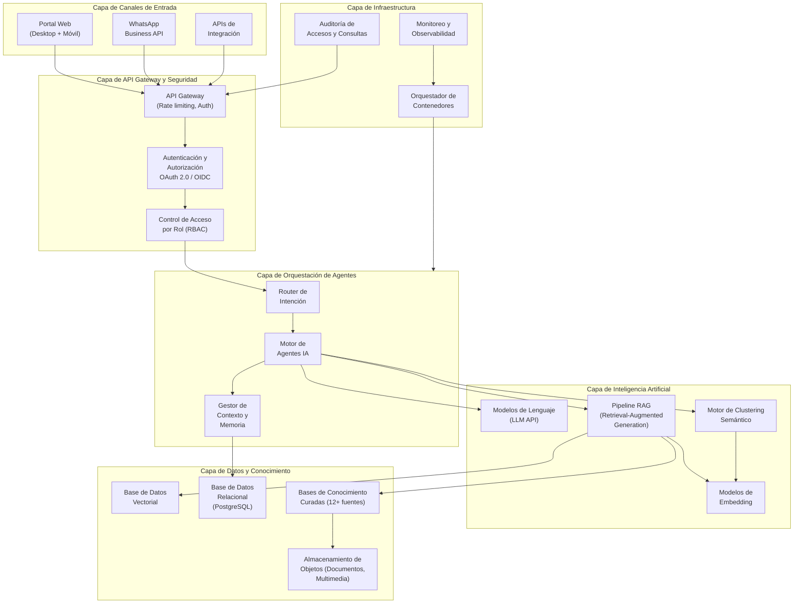
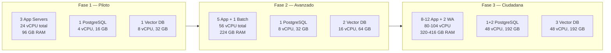

# Asistente Inteligente
## Descripción de Proyecto — Sistema de Inteligencia Colectiva de Querétaro (SIC-Q)

**Preparado para:** Subsecretaría de Tecnologías, Secretaría de Finanzas del Estado de Querétaro
**Fecha:** Marzo 2026
**Elaborado por:** Horizons Architecture

---

## 1. Descripción del proyecto y objetivo

El Asistente Inteligente del SIC-Q (Sistema de Inteligencia Colectiva de Querétaro) es una plataforma de inteligencia artificial que integra datos oficiales, voz ciudadana, marcos legales y contexto operativo en un punto único de consulta para servidores públicos del Gobierno del Estado de Querétaro.

El sistema opera como un servicio en la nube que se despliega en versiones personalizadas por rol: Gobernador, Secretario de Planeación, Secretario de Finanzas, Director de Planeación, y progresivamente cualquier secretaría. Cada versión tiene un nivel de acceso diferenciado según el perfil del usuario y protocolos de protección de información sensible.

El Asistente Inteligente procesa consultas en lenguaje natural y cruza automáticamente fuentes que hoy viven dispersas entre dependencias — lo que actualmente requiere coordinar varias secretarías durante días o semanas, el sistema lo resuelve en minutos.

### Objetivos

- Integrar datos de múltiples dependencias en una capa unificada de inteligencia que permita consultas cruzadas en tiempo real.
- Procesar y sintetizar voz ciudadana (talleres, propuestas, consultas) mediante análisis semántico para vincularla con datos oficiales y marcos legales.
- Generar productos de inteligencia institucional (fichas ejecutivas, briefings, alertas, reportes cruzados) de forma automatizada y bajo demanda.
- Ofrecer trazabilidad completa sobre el origen y la procedencia de cada dato presentado.
- Habilitar el procesamiento automatizado de insumos para la actualización del Plan QRO 2050 con control de cambios y trazabilidad ciudadana.
- Operar como infraestructura institucional transferible, con propiedad del gobierno sobre datos, código e infraestructura.

---

## 2. Arquitectura tecnológica

La arquitectura del Asistente Inteligente sigue un diseño cloud-native agnóstico — no está atada a un proveedor de nube específico y puede desplegarse sobre cualquier infraestructura de nube pública (AWS, Azure, GCP) o privada, según las políticas tecnológicas del gobierno.

### Stack tecnológico

| Capa | Tecnología | Descripción |
|------|-----------|-------------|
| **Backend / API** | Python 3.12+, FastAPI | Servicios REST y WebSocket para comunicación con clientes y orquestación de agentes |
| **Modelos de IA** | APIs de Modelos de Lenguaje (LLM) | Agnóstico de proveedor: compatible con Anthropic (Claude), OpenAI (GPT), modelos open-source (Llama, Mistral). Selección según costo-rendimiento por tarea |
| **Embeddings** | Modelos de embedding de texto | Transformación de texto libre a vectores numéricos para búsqueda semántica y clustering |
| **RAG** | LangChain / LlamaIndex | Pipeline de Retrieval-Augmented Generation: búsqueda en bases de conocimiento + generación contextualizada |
| **Base de datos vectorial** | pgvector / Milvus / Pinecone | Almacenamiento y búsqueda de similitud semántica sobre propuestas ciudadanas y documentos del estado |
| **Base de datos relacional** | PostgreSQL 16+ | Datos de usuarios, sesiones, permisos, auditoría, metadata de propuestas, registros de participación |
| **Almacenamiento de objetos** | S3-compatible (MinIO / Cloud Storage) | Documentos fuente, PDFs, multimedia, respaldos |
| **Frontend web** | React / Next.js, Tailwind CSS | Interfaz phone-first para ejecutivos, desktop para equipos de planeación |
| **Mensajería** | WhatsApp Business API, WebSockets | Canal ciudadano y de consulta para funcionarios vía WhatsApp |
| **Contenedores** | Docker, Kubernetes (K8s) | Orquestación de microservicios, escalamiento automático, alta disponibilidad |
| **API Gateway** | Kong / Traefik | Rate limiting, autenticación, enrutamiento, logging de peticiones |
| **Autenticación** | OAuth 2.0 / OpenID Connect | Single sign-on, tokens JWT, integración con directorio activo del gobierno |
| **Observabilidad** | Prometheus, Grafana, OpenTelemetry | Monitoreo de salud, métricas de rendimiento, alertas operativas |
| **CI/CD** | GitHub Actions / GitLab CI | Integración continua, despliegue automatizado por ambiente (dev, staging, producción) |
| **Seguridad** | TLS 1.3, cifrado en reposo AES-256 | Comunicaciones cifradas, datos en reposo protegidos, auditoría de accesos |

---

## 3. Módulos del sistema

### Módulo 1 — Motor de Agentes de Inteligencia

El componente central del sistema. Orquesta agentes de IA especializados que procesan consultas cruzando múltiples fuentes de datos.

1. **Router de intención**
   - Clasifica la consulta del usuario (persona, lugar, tema, legal, electoral, análisis cruzado)
   - Determina qué fuentes de datos y agentes activar
   - Gestiona el contexto de la conversación

2. **Agentes por rol**
   - Agente del Gobernador: briefings de gira, fichas de persona, análisis cruzados, líneas discursivas
   - Agente del Secretario de Planeación: cruces de indicadores, marco legal, voz ciudadana por tema
   - Agente del Secretario de Finanzas: seguimiento presupuestal, avance del PED, alertas de desalineación
   - Agente de Planeación (Plan QRO 2050): control de cambios, priorización de proyectos, fichas municipales

3. **Sub-agentes operativos**
   - Investigación: búsqueda y recopilación en bases de conocimiento
   - Análisis: procesamiento y cruce de fuentes
   - Producción: generación de fichas, briefings, reportes
   - Validación: verificación de consistencia y trazabilidad de fuentes

### Módulo 2 — Bases de conocimiento y gestión de datos

Sistema de ingesta, curación y almacenamiento de fuentes de información del estado.

1. **Ingesta de fuentes**
   - Carga de documentos en múltiples formatos: PDF, DOCX, XLSX, CSV, PPTX
   - Procesamiento automático: segmentación, vectorización, indexación
   - Versionamiento de documentos con control de cambios

2. **Bases de conocimiento activas**
   - Constitución del Estado de Querétaro
   - 112 leyes estatales vigentes
   - Plan Estatal de Desarrollo 2022-2027 (65 retos, 6 ejes)
   - Plan QRO 2050
   - Datos INEGI (censo, ENOE, DENUE)
   - Proyecciones CONAPO 2020-2070
   - Minutas de 23 consejos temáticos
   - Infraestructura de salud (CLUES)
   - Programa Hídrico Estatal
   - Talleres de participación ciudadana (778 ideas procesadas)
   - Logros por secretaría 2022-2025
   - Monitoreo de prensa estatal y nacional

3. **Motor de búsqueda semántica**
   - Búsqueda por similitud en base vectorial
   - Ranking de relevancia con puntuación de confianza
   - Trazabilidad: cada dato vinculado a su documento y sección de origen

### Módulo 3 — Motor de inteligencia colectiva

Procesamiento automatizado de participación ciudadana a escala.

1. **Clustering semántico**
   - Agrupación automática de propuestas por afinidad temática (e.g., 500 personas hablando de "seguridad" y "alumbrado" se agrupan aunque usen palabras distintas)
   - Detección de consensos emergentes
   - Identificación de prioridades colectivas

2. **Análisis multidimensional**
   - Evaluación de cada propuesta en 6 dimensiones: Legado, Comunidad, Aprendizaje, Tecnología, Contexto, Proyectos
   - Proyección temporal: corto, mediano y largo plazo
   - Detección de temas emergentes no contemplados en el plan vigente

3. **Síntesis y reportes**
   - Generación automática de reportes de inteligencia colectiva
   - Control de cambios al Plan QRO 2050 con trazabilidad por propuesta y origen
   - Ranking de prioridades consolidando múltiples fuentes de votación

### Módulo 4 — Participación ciudadana multicanal

Interfaz de interacción con la ciudadanía.

1. **Portal web (responsive / phone-first)**
   - Modo Visitante: explorar propuestas y conversar sin registro
   - Modo Participante: apoyar propuestas (registro ligero: celular + código postal)
   - Modo Ciudadano Verificado: crear propuestas (celular + CURP + código postal)

2. **Integración WhatsApp**
   - Conversación guiada con agente IA
   - Captura de propuestas vía diálogo en lenguaje natural
   - Notificaciones de seguimiento al ciudadano

3. **Sistema de seguimiento**
   - Notificaciones en tiempo real sobre estado de propuestas
   - Respuesta del gobierno con compromiso de máximo 60 días
   - Ciclo de retroalimentación que fortalece la confianza y la participación

### Módulo 5 — Seguridad, permisos y auditoría

1. **Control de acceso por rol (RBAC)**
   - Permisos diferenciados: Gobernador, Secretarías, Instituto del Futuro, Consejos Ciudadanos
   - Cada usuario opera dentro de su perímetro de acceso
   - Gestión de información sensible con niveles de clasificación

2. **Auditoría**
   - Registro de todas las consultas realizadas al sistema
   - Trazabilidad de accesos a información sensible
   - Reportes de uso por usuario y dependencia

3. **Protección de datos**
   - Cifrado en tránsito (TLS 1.3) y en reposo (AES-256)
   - Cumplimiento con Ley General de Protección de Datos Personales en Posesión de Sujetos Obligados
   - Minimización de datos personales: solo los necesarios para verificación de identidad

### Módulo 6 — Panel de administración y observabilidad

1. **Dashboard de operación**
   - Estado de salud del sistema en tiempo real
   - Métricas de uso: consultas por día, tiempos de respuesta, fuentes más consultadas
   - Alertas de capacidad y rendimiento

2. **Gestión de contenido**
   - Interfaz para carga y actualización de bases de conocimiento
   - Configuración de agentes y permisos
   - Administración de canales de participación ciudadana

---

## 4. Requerimientos de hardware

El sistema opera 100% en la nube. Los requerimientos se especifican de forma agnóstica para permitir despliegue en cualquier proveedor (AWS, Azure, GCP) o infraestructura privada.

### Fase 1 — Agentes de inteligencia (piloto, ~500 usuarios internos)

| Componente | Especificación | Función |
|------------|---------------|---------|
| **Servidores de aplicación (API + Agentes)** | 3 instancias × 8 vCPU, 32 GB RAM, 100 GB SSD | Backend API, motor de agentes, pipeline RAG |
| **Base de datos relacional (PostgreSQL)** | 1 instancia × 4 vCPU, 16 GB RAM, 500 GB SSD | Usuarios, sesiones, auditoría, metadata |
| **Base de datos vectorial** | 1 instancia × 8 vCPU, 32 GB RAM, 200 GB SSD | Embeddings de documentos, búsqueda semántica |
| **Almacenamiento de objetos** | 1 TB | Documentos fuente, PDFs, respaldos |
| **Cache / Cola de mensajes** | 1 instancia × 2 vCPU, 8 GB RAM | Redis: cache de sesiones, cola de tareas asíncronas |
| **Balanceador de carga** | 1 instancia gestionada | Distribución de tráfico, terminación SSL |

### Fase 2 — Métodos avanzados + Dashboard (~2,000 usuarios)

| Componente | Especificación | Función |
|------------|---------------|---------|
| **Servidores de aplicación** | 5 instancias × 8 vCPU, 32 GB RAM, 100 GB SSD | Escalamiento horizontal para más agentes y dashboards |
| **Base de datos relacional** | 1 instancia × 8 vCPU, 32 GB RAM, 1 TB SSD | Mayor volumen de datos de participación y seguimiento |
| **Base de datos vectorial** | 2 instancias × 8 vCPU, 32 GB RAM, 500 GB SSD | Cluster para alta disponibilidad y más fuentes indexadas |
| **Almacenamiento de objetos** | 3 TB | Crecimiento de fuentes y documentos del estado |
| **Servidor de procesamiento batch** | 1 instancia × 16 vCPU, 64 GB RAM, 200 GB SSD | Clustering semántico masivo, procesamiento del Plan QRO 2050 |
| **CDN** | Servicio gestionado | Distribución de assets estáticos del dashboard |

### Fase 3 — Plataforma ciudadana (~50,000 usuarios)

| Componente | Especificación | Función |
|------------|---------------|---------|
| **Servidores de aplicación** | 8-12 instancias × 8 vCPU, 32 GB RAM, 100 GB SSD (auto-scaling) | Escalamiento elástico para tráfico ciudadano variable |
| **Base de datos relacional** | 1 primaria + 2 réplicas × 16 vCPU, 64 GB RAM, 2 TB SSD | Alta disponibilidad, réplicas de lectura |
| **Base de datos vectorial** | Cluster 3 nodos × 16 vCPU, 64 GB RAM, 1 TB SSD | Procesamiento de miles de propuestas concurrentes |
| **Almacenamiento de objetos** | 10 TB | Multimedia ciudadana, archivos históricos |
| **Cola de mensajes** | Cluster 3 nodos × 4 vCPU, 16 GB RAM | Procesamiento asíncrono de propuestas y notificaciones |
| **Servidor WhatsApp** | 2 instancias × 4 vCPU, 16 GB RAM | Integración WhatsApp Business API |
| **CDN** | Servicio gestionado con caché global | Distribución de la plataforma web ciudadana |

### Resumen de infraestructura

### Requisitos de red y conectividad

| Componente | Especificación |
|------------|---------------|
| Ancho de banda | 1 Gbps dedicado (Fase 1-2), 10 Gbps (Fase 3) |
| Latencia | < 100ms para consultas en lenguaje natural |
| DNS | Dominio bajo control del gobierno (.gob.mx) |
| Certificados SSL | TLS 1.3, certificados gestionados |
| VPN / Peering | Conexión segura entre infraestructura cloud y red del gobierno |

---

## 5. Plan de transferencia

El plan de transferencia garantiza que el Gobierno del Estado de Querétaro sea propietario y operador independiente de toda la infraestructura, el código y los datos al término del contrato.

### Actividades de instalación, despliegue y configuración

#### Fase 1 — Instalación base (Semanas 1-4)

| Actividad | Descripción | Entregable |
|-----------|-------------|------------|
| Provisión de infraestructura cloud | Creación de cuentas cloud a nombre del gobierno, configuración de redes virtuales, grupos de seguridad, almacenamiento | Infraestructura cloud operativa en cuentas del gobierno |
| Configuración de ambientes | Despliegue de ambientes de desarrollo, staging y producción con pipelines CI/CD | 3 ambientes configurados con despliegue automatizado |
| Instalación de servicios base | Cluster de contenedores (Kubernetes), bases de datos, cache, balanceadores, monitoreo | Servicios base operativos con alta disponibilidad |
| Configuración de seguridad | OAuth 2.0/OIDC, integración con directorio activo, RBAC, cifrado, auditoría | Sistema de seguridad operativo y documentado |
| Carga inicial de bases de conocimiento | Ingesta y vectorización de las 12+ fuentes de datos prioritarias | Bases de conocimiento indexadas y consultables |

#### Fase 1 — Despliegue de agentes (Semanas 5-12)

| Actividad | Descripción | Entregable |
|-----------|-------------|------------|
| Despliegue de agentes por rol | Configuración y calibración de agentes para Gobernador, Planeación, Finanzas, Plan QRO 2050 | 4 agentes de inteligencia operativos |
| Pruebas de integración | Validación de cruces de fuentes, calidad de respuestas, manejo de casos edge | Reporte de pruebas con métricas de calidad |
| Capacitación a usuarios clave | Sesiones con equipos de cada secretaría sobre uso y capacidades del sistema | Usuarios capacitados, guías de uso |
| Piloto supervisado | Operación con acompañamiento durante 4 semanas con ajustes iterativos | Sistema en operación validado por usuarios |

#### Fase 2 — Expansión (Semanas 13-28)

| Actividad | Descripción | Entregable |
|-----------|-------------|------------|
| Despliegue de procesamiento avanzado | Métodos de clustering masivo, detección de temas emergentes, fichas municipales automatizadas | Motor de inteligencia colectiva operativo |
| Despliegue de dashboard | Panel de visualización para Secretaría de Planeación y CONSEQRO | Dashboard en producción |
| Ampliación de fuentes | Incorporación de datos de más secretarías, comparativos, CRM | Bases de conocimiento ampliadas |
| Escalamiento de infraestructura | Adición de nodos, réplicas de BD, servidor de procesamiento batch | Infraestructura Fase 2 operativa |

#### Fase 3 — Plataforma ciudadana (Semanas 29-48)

| Actividad | Descripción | Entregable |
|-----------|-------------|------------|
| Despliegue de portal ciudadano | Plataforma web responsive con los 3 modos de participación | Portal ciudadano en producción |
| Integración WhatsApp | Conexión con WhatsApp Business API, flujos de conversación, notificaciones | Canal WhatsApp operativo |
| Escalamiento elástico | Auto-scaling para manejar picos de participación ciudadana | Infraestructura Fase 3 con escalamiento automático |
| Pruebas de carga | Validación con simulación de 50,000 usuarios concurrentes | Reporte de rendimiento y capacidad |

### Transferencia de conocimiento y propiedad

| Componente | Mecanismo de transferencia | Cronograma |
|------------|---------------------------|------------|
| **Código fuente** | Repositorio Git entregado al gobierno al cierre de cada fase, con documentación técnica y guías de desarrollo | Al cierre de cada fase |
| **Infraestructura cloud** | Cuentas cloud a nombre del gobierno desde el día 1. HA opera como administrador delegado durante el contrato | Desde inicio |
| **Bases de conocimiento** | Datos curados, índices vectoriales y documentos fuente son propiedad del gobierno. Exportables en formatos estándar | Continuo |
| **Documentación técnica** | Arquitectura, diagramas, runbooks de operación, procedimientos de actualización, guías de troubleshooting | Al cierre de cada fase |
| **Capacitación al equipo de TI** | Programa de transferencia de conocimiento al equipo de la Subsecretaría de Tecnologías: administración, monitoreo, actualización de bases, gestión de permisos | Fases 2-3 |
| **Soporte post-contrato** | Periodo de acompañamiento de 3 meses post-cierre para estabilización y resolución de dudas | Post-cierre |

### Independencia operativa al término del contrato

Al finalizar, el Gobierno del Estado de Querétaro cuenta con:

1. **Infraestructura cloud** en cuentas propias, operativa y documentada.
2. **Código fuente completo** con repositorio, historial y documentación.
3. **Bases de conocimiento** curadas y actualizadas, exportables.
4. **Equipo capacitado** en la Subsecretaría de Tecnologías para operación autónoma.
5. **Runbooks de operación** para mantenimiento, actualización de modelos, carga de nuevas fuentes y escalamiento.
6. **Sin dependencia de componentes propietarios** — la arquitectura usa servicios de nube estándar y software de código abierto donde es posible, permitiendo migración entre proveedores.

---

