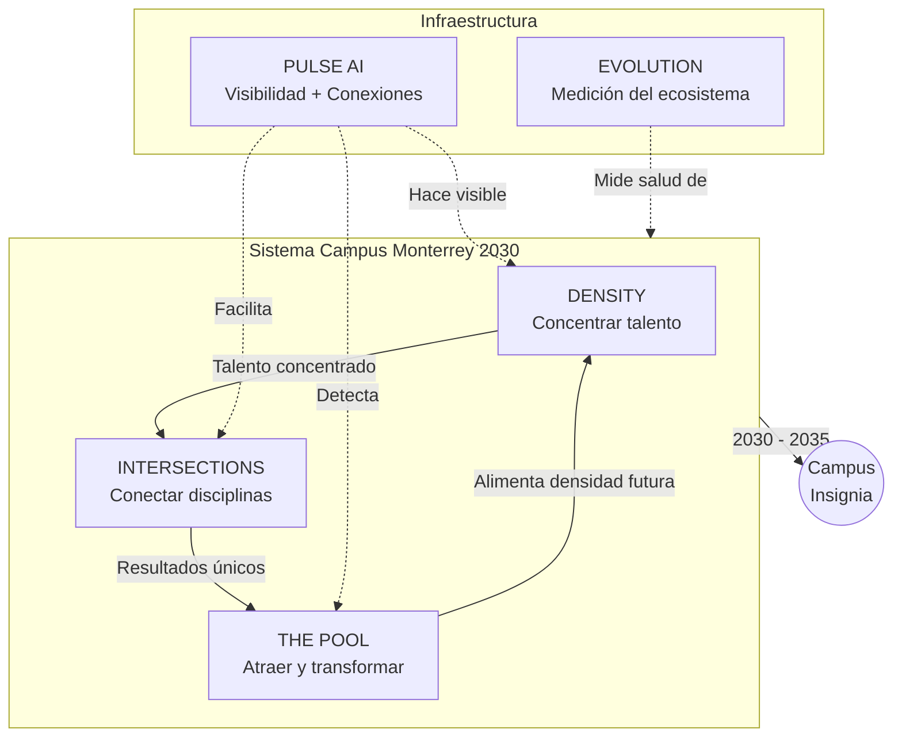

# Los 5 Proyectos Paraguas — Campus Monterrey 2030

---

## Elevator Pitch

Organizar la estrategia del Campus Monterrey en 5 proyectos paraguas que dan coherencia y dirección a las decenas de iniciativas existentes.

| Proyecto | Función |
|----------|---------|
| **Density** | Concentrar y mapear talento excepcional (academia, industria, gobierno) |
| **Intersections** | Provocar cruces interdisciplinarios que produzcan lo que ninguna escuela lograría sola |
| **The Pool** | Detectar y atraer proactivamente a los mejores estudiantes y profesores |
| **Pulse AI** | Hacer visible el ecosistema y facilitar conexiones mediante IA |
| **Evolution** | Medir la salud del campus como sistema, no solo como suma de partes |

**La lógica:** Más densidad → más intersecciones → mejor talento → mayor inteligencia colectiva → evolución medible rumbo a 2035.

**Resultado:** Las iniciativas existentes encuentran su lugar en un sistema conectado donde el todo es mayor que la suma de las partes.

---

## Diagrama del Sistema

**Lectura del diagrama:**
- **Ciclo central:** Density → Intersections → The Pool → (retroalimenta) Density
- **Pulse AI:** Infraestructura que hace visible y conecta todo el sistema
- **Evolution:** Mide si el ecosistema avanza en la dirección correcta

---

## Idea Central

Para construir una estrategia efectiva es necesario organizar los esfuerzos en proyectos paraguas, dentro de los cuales convivan múltiples iniciativas existentes y futuras. Es mucho más claro y comunicable explicar cinco grandes conceptos que decenas de proyectos aislados. Estos proyectos paraguas permiten articular la ejecución, los accionables y las intersecciones entre iniciativas.

---

## 1. Density — Densidad de Talento

La primera dimensión es Density, entendida como la concentración intencional de talento excepcional en el Campus Monterrey, como campus insignia. La densidad no se limita a profesores o facultad, sino que incluye talento de la industria, el gobierno y el sector social interesados en resolver problemas reales junto con el Tec.

**Implica:**

- Mapear estructuradamente dónde está el talento.
- Medir y visualizar la densidad del talento en el campus.
- Diseñar estrategias de atracción diferenciada.
- Construir alianzas de investigación aplicada.
- Implementar mecanismos de retención estratégica del mejor talento.

---

## 2. Intersections — Intersecciones Disciplinarias

Una vez construida la densidad, el siguiente paso es conectar ese talento para lograr resultados que ninguna disciplina lograría por sí sola. Los problemas reales requieren múltiples perspectivas, y en esas interacciones pueden emerger nuevas líneas de investigación y ciencia básica.

**Este eje busca:**

- Fomentar proyectos interdisciplinarios.
- Generar intersecciones entre ingeniería, ciencia de datos, medicina, humanidades digitales, entre otras.
- Crear iniciativas de mayor escala e impacto ("big bets").
- Posicionar globalmente al campus mediante proyectos insignia.

**Ejemplos:** X Labs, programas de integración ingeniería–medicina, fondos de impacto, emprendimiento, proyectos territoriales en el distrito, embajadores de facultad.

---

## 3. The Pool — Atracción y Transformación de Talento

The Pool se enfoca en atraer y transformar a los mejores estudiantes y profesores de México y la región. Busca crear un sistema integrado para detectar talento con alto potencial y actitud ("hambre" de crecer y transformar).

**Incluye:**

- Sistemas de detección temprana de talento (olimpiadas, competencias académicas, liderazgo).
- Uso de data para atracción proactiva.
- Programas altamente selectivos.
- Un radar estructurado y continuo de talento excepcional.

---

## 4. Pulse AI — Inteligencia para Conectar el Ecosistema

Pulse AI es la infraestructura de inteligencia artificial que hace visible la red y facilita conexiones. Permite que el ecosistema funcione como un sistema integrado y no como silos aislados.

**Funciones clave:**

- Mapa vivo de colaboraciones.
- Agentes inteligentes del campus (investigación, plan de vida, afinidades).
- Identificación de quién investiga qué, con quién y en qué temas.
- Sensemaking: dar sentido a grandes volúmenes de información para tomar mejores decisiones.

---

## 5. Evolution — Medición de la Evolución del Ecosistema

Evolution permite evaluar si el campus avanza en la dirección correcta, más allá de métricas tradicionales como matrícula o publicaciones.

**Busca medir:**

- Salud del campus como ecosistema.
- Calidad y número de conexiones generadas.
- Velocidad de conversión de pilotos a startups.
- Atracción y aceptación de talento de alto nivel.
- Emprendimientos y proyectos surgidos de estas interacciones.

---

## Connections

- [[ncm-2030-narrative]]
- [[01-legacy-ncm]]
