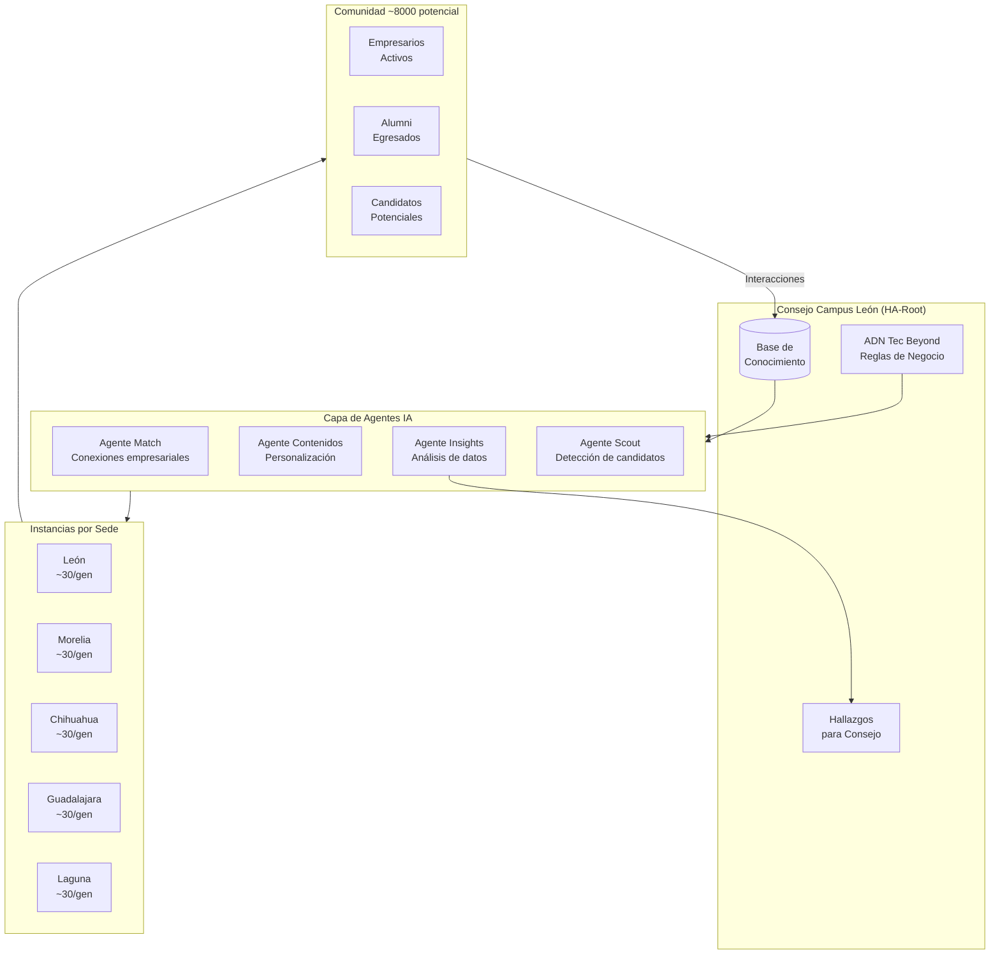

# Arquitectura de la Plataforma Tec Beyond + HA

> Documentación técnica de la arquitectura propuesta.

---

## Visión de Arquitectura



---

## Componentes del Sistema

### 1. HA-Root (Consejo Campus León)

| Componente | Función |
|------------|---------|
| **ADN Tec Beyond** | Reglas de negocio, valores, criterios de admisión |
| **Base de Conocimiento** | Datos acumulados de todas las generaciones |
| **Panel de Hallazgos** | Insights consolidados para toma de decisiones |

### 2. Capa de Agentes IA

| Agente | Función | Tecnología |
|--------|---------|------------|
| **Agente Match** | Conectar empresarios con oportunidades de negocio (anonimizado) | Claude / GPT-4 |
| **Agente Contenidos** | Personalizar contenido según intereses y perfil | RAG + embeddings |
| **Agente Insights** | Analizar patrones, clustering, tendencias | Analytics + LLM |
| **Agente Scout** | Detectar candidatos potenciales en redes | Scraping + IA |

### 3. Instancias por Sede

Cada sede opera como una **instancia fractal** de la arquitectura:
- Comparte el ADN y reglas de negocio del root
- Tiene autonomía operativa local
- Contribuye datos a la base de conocimiento central
- Recibe insights personalizados para su contexto

### 4. Fuentes de Datos

| Fuente | Tipo | Uso |
|--------|------|-----|
| LinkedIn | Perfiles profesionales | Scout de candidatos |
| Facebook | Redes sociales | Comunidad y engagement |
| WhatsApp/Web | Interacciones | Conversaciones con agentes |
| Notas/PRS | Documentos | Base de conocimiento |
| Encuestas | Feedback | Mejora continua |

---

## Reglas de Negocio (Outputs de Valor)

| Regla | Descripción | Monetización |
|-------|-------------|--------------|
| **Suscripción** | Membresía al club/comunidad | Fee anual |
| **Datos/Hallazgos** | Insights de la inteligencia colectiva | Incluido en suscripción |
| **Match** | Conexiones empresariales facilitadas | % de transacción o fee |
| **Clustering** | Segmentación por sector/interés | Eventos especializados |
| **Experiencias** | Rituales, eventos memorables | Fee por evento |
| **Contenidos** | Capacitación personalizada (2da, 3ra fase) | Cursos adicionales |

---

## Modelo Híbrido

| Modalidad | Uso |
|-----------|-----|
| **Presencial** | Experiencias memorables, rituales, networking físico |
| **En Línea** | Interacción con agentes, contenido, match, seguimiento |

---

## Escalabilidad Fractal

```
Año 1-2:  León (piloto) ────────────────────── ~300 miembros
Año 2-3:  + Morelia, Chihuahua ────────────── ~900 miembros
Año 3-4:  + Guadalajara, Laguna ───────────── ~1,500 miembros
Año 5+:   + Querétaro, CDMX, etc. ─────────── ~3,000+ miembros
Visión 10 años: ───────────────────────────── ~8,000 miembros
```

Cada generación: ~30 personas
9 generaciones en León = ~270 alumni base inicial

---

## Stack Tecnológico Propuesto

| Capa | Tecnología |
|------|------------|
| **LLM Principal** | Claude 4.5 (CI) / GPT-4o |
| **Orquestación** | Horizons Architecture (HA) |
| **Base de Conocimiento** | Vector DB + RAG |
| **Frontend** | Web app + WhatsApp integration |
| **Analytics** | Dashboard para Consejo |
| **Infraestructura** | Azure (alineado con Tec) |

---

## Connections

- [[01-legacy-tec-beyond]]
- [[ha-root-tec-beyond]]
