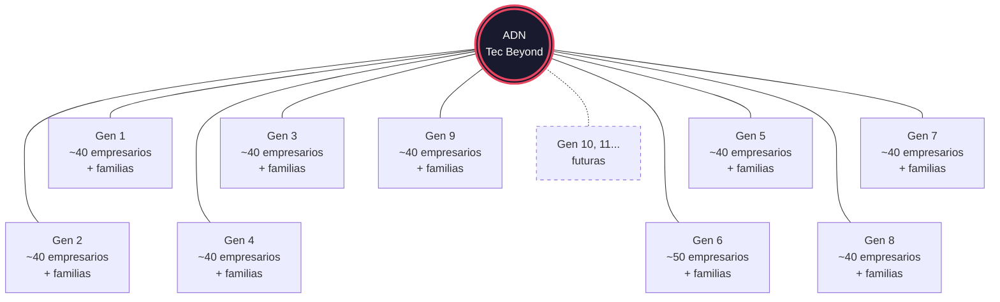
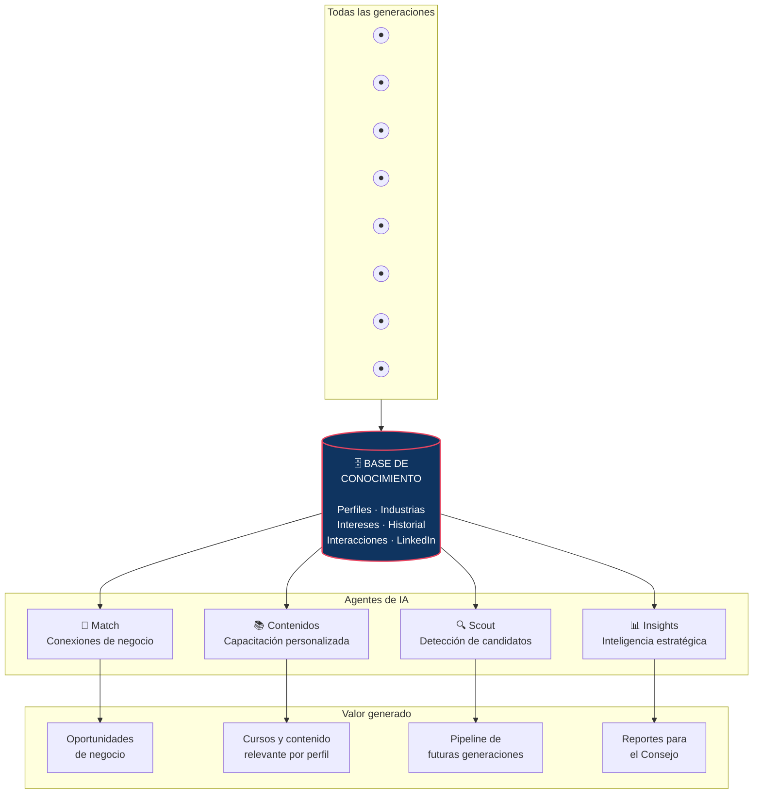
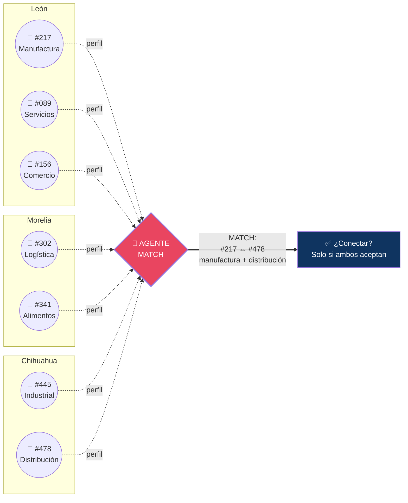
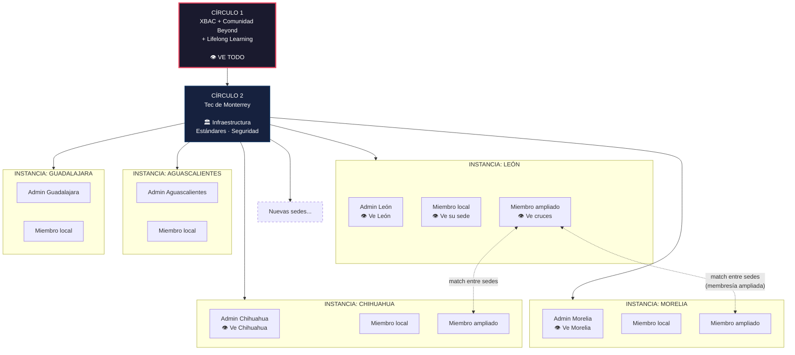

# Visuales: Tec Beyond — Nueva Etapa

> Referencia visual para diseño. Cada diagrama corresponde a un concepto clave del documento.
> Basado en los bocetos de la reunión presencial Edgar–Mario (feb 2026).

---

## Visual 1: Las generaciones como organismo vivo

**Concepto:** Tec Beyond no es una lista de egresados — es un organismo que crece con cada generación. En el centro está el ADN del programa (valores, metodología, identidad). Cada generación se conecta al centro y a las demás. Con el tiempo, la red se vuelve más densa y más valiosa.



**Texto acompañante:**

```
                                    Gen 1       Gen 2
                                   ╱    ╲      ╱    ╲
                              ●  ●  ●  ●  ●  ●  ●  ●
                                 ╲   ╲  │  ╱   ╱
                     Gen 3        ╲   ╲ │ ╱   ╱        Gen 4
                    ╱    ╲         ╲   ╲│╱   ╱        ╱    ╲
               ●  ●  ●  ● ─────────◉◉◉◉◉──────── ●  ●  ●  ●
                                    A D N
               ●  ●  ●  ● ─────────◉◉◉◉◉──────── ●  ●  ●  ●
                    ╲    ╱         ╱   ╱│╲   ╲        ╲    ╱
                     Gen 5        ╱   ╱ │ ╲   ╲        Gen 6
                              ●  ●  ●  ●  ●  ●  ●  ●
                                 ╱   ╱  │  ╲   ╲
                                    Gen 7       Gen 8
                                   ╱    ╲      ╱    ╲
                              ●  ●  ●  ●  ●  ●  ●  ●

                                    Gen 9 ···  Gen N
                                  (futuras)

              350 empresarios → 700 con familias → 3,000 con colaboradores
```

**Nota para diseño:** El ADN central es denso, oscuro, con peso visual. Las generaciones son orgánicas (no cajas rígidas). Las conexiones son curvas, no rectas. Debería sentirse como un sistema nervioso o una galaxia — no como un organigrama.

---

## Visual 2: La base de conocimiento

**Concepto:** Toda la información de todas las generaciones (pasadas y futuras) se vierte en una base de conocimiento. No es una hoja de Excel — es un sistema que entiende relaciones. De ahí salen agentes que generan valor: conexiones, contenido, detección de candidatos, insights.



**Versión ASCII:**

```
     Gen 1    Gen 2    Gen 3    Gen 4    Gen 5    Gen 6    Gen 7    Gen 8    Gen 9
      ●●●      ●●●      ●●●      ●●●      ●●●      ●●●      ●●●      ●●●      ●●●
       │         │         │         │         │         │         │         │         │
       │         │         │         │         │         │         │         │         │
       └─────────┴─────────┴─────────┴────┬────┴─────────┴─────────┴─────────┘         │
                                          │                                            │
                                          ▼                                            │
                                ┌───────────────────┐                                  │
                                │                   │◄─────────────────────────────────┘
                                │      BASE DE      │
                                │   CONOCIMIENTO    │◄─── futuras generaciones
                                │                   │
                                │  perfiles         │
                                │  industrias       │
                                │  intereses        │
                                │  interacciones    │
                                │  LinkedIn         │
                                │  documentos       │
                                └─────────┬─────────┘
                                          │
                       ┌──────────┬───────┴───────┬──────────┐
                       │          │               │          │
                       ▼          ▼               ▼          ▼
                   ┌────────┐ ┌────────┐    ┌────────┐ ┌────────┐
                   │ MATCH  │ │CONTENIDO│   │ SCOUT  │ │INSIGHTS│
                   │        │ │        │    │        │ │        │
                   │Conexión│ │Cursos y │    │Detecta │ │Reportes│
                   │  de    │ │contenido│    │futuros │ │  para  │
                   │negocio │ │personal.│    │candid. │ │Consejo │
                   └───┬────┘ └───┬────┘    └───┬────┘ └───┬────┘
                       │          │              │          │
                       ▼          ▼              ▼          ▼
                  Oportunidades  Aprendizaje   Pipeline   Hallazgos
                  de negocio     a la medida   de talento  estratégicos
```

**Nota para diseño:** La base de conocimiento debe verse como un contenedor sólido (cilindro o esfera) con densidad visual. Las generaciones entran como flujos (no como cajas). Los agentes son nodos activos con identidad propia. Las salidas son el valor tangible. El flujo va de arriba (personas) hacia abajo (valor).

---

## Visual 3: Matching entre usuarios anonimizados

**Concepto:** El agente de IA analiza toda la red, identifica complementariedades entre miembros, y propone conexiones de forma anonimizada. Nadie ve los datos de nadie hasta que ambos aceptan.



**Versión ASCII:**

```
       LEÓN                    MORELIA                CHIHUAHUA
    ┌──────────┐            ┌──────────┐           ┌──────────┐
    │ #217 ●   │            │ #302 ●   │           │ #445 ●   │
    │ #089 ●   │            │ #341 ●   │           │ #478 ●   │
    │ #156 ●   │            │          │           │          │
    │  ...     │            │  ...     │           │  ...     │
    └────┬─────┘            └────┬─────┘           └────┬─────┘
         │                       │                      │
         │    perfiles           │   perfiles           │   perfiles
         │   anonimizados        │  anonimizados        │  anonimizados
         │                       │                      │
         └───────────────────────┼──────────────────────┘
                                 │
                                 ▼
                    ┌─────────────────────────┐
                    │                         │
                    │    🤖  AGENTE MATCH     │
                    │                         │
                    │  Analiza:               │
                    │  · industrias           │
                    │  · capacidades          │
                    │  · necesidades          │
                    │  · ubicación            │
                    │                         │
                    └────────────┬────────────┘
                                 │
                                 ▼
                    ┌─────────────────────────┐
                    │                         │
                    │  HALLAZGO:              │
                    │                         │
                    │  "El miembro #217       │
                    │   (manufactura, León)   │
                    │   y el miembro #478     │
                    │   (distribución,        │
                    │    Chihuahua)           │
                    │   tienen un match."     │
                    │                         │
                    │  ¿Conectar?             │
                    │  Solo si ambos aceptan. │
                    │                         │
                    └─────────────────────────┘

    SIN consentimiento mutuo → nadie sabe nada
    CON consentimiento mutuo → se hace la introducción
```

**Nota para diseño:** Los miembros deben verse como puntos o íconos genéricos (sin rostro — están anonimizados). El agente es el nodo central con protagonismo visual. Las líneas que entran son punteadas (datos anonimizados), la línea que sale es sólida (el match confirmado). El "¿Conectar?" debe sentirse como un momento de decisión humana, no automática.

---

## Visual 4: Árbol de jerarquía y permisos

**Concepto:** Horizons Architecture permite definir quién ve qué. El primer círculo ve todo. Conforme baja el árbol, los permisos se acotan. Cada sede es una instancia con su propia comunidad. Las membresías definen el alcance de acceso.



**Versión ASCII — El árbol de permisos:**

```
                        ┌─────────────────────────────────────┐
                        │         CÍRCULO 1                   │
                        │  XBAC + Comunidad Beyond + LLL      │
                        │                                     │
                        │  👁️  ACCESO TOTAL                   │
                        │  Toda la red. Todos los datos.      │
                        │  Reportes nacionales. Decisiones.   │
                        └──────────────────┬──────────────────┘
                                           │
                        ┌──────────────────┴──────────────────┐
                        │         CÍRCULO 2                   │
                        │      Tec de Monterrey               │
                        │                                     │
                        │  🏛️  INFRAESTRUCTURA                │
                        │  Servidores. Seguridad. Estándares. │
                        │  Contraparte: Gerardo Martínez      │
                        └──────────────────┬──────────────────┘
                                           │
              ┌────────────┬───────────────┼───────────────┬────────────┐
              │            │               │               │            │
              ▼            ▼               ▼               ▼            ▼
        ┌──────────┐ ┌──────────┐   ┌──────────┐   ┌──────────┐ ┌ ─ ─ ─ ─ ┐
        │  LEÓN    │ │ MORELIA  │   │CHIHUAHUA │   │  AGUAS-  │   Nuevas
        │          │ │          │   │          │   │ CALIENTES│   sedes
        │ Admin:   │ │ Admin:   │   │ Admin:   │   │ Admin:   │ │ ···     │
        │ ve León  │ │ve Morelia│   │ve Chihua.│   │ ve Aguas │
        │          │ │          │   │          │   │          │ └ ─ ─ ─ ─ ┘
        │ ● ● ●   │ │ ● ● ●   │   │ ● ● ●   │   │ ● ● ●   │
        │ ● ● ●   │ │ ● ● ●   │   │ ● ● ●   │   │ ● ●     │
        │ miembros │ │ miembros │   │ miembros │   │ miembros │
        └──────────┘ └──────────┘   └──────────┘   └──────────┘
              │            │               │
              └──── ◇ ─────┴─────── ◇ ─────┘
                   match          match
              (membresía       (membresía
               ampliada)        ampliada)


    NIVELES DE ACCESO:

    ┌─────────────────────────┬──────────────────────────────────────────┐
    │ Quién                   │ Qué ve                                  │
    ├─────────────────────────┼──────────────────────────────────────────┤
    │ Círculo 1               │ Todo. Toda la red. Todos los reportes.  │
    │ Admin de sede           │ Solo su sede. Sus miembros. Su data.    │
    │ Miembro local           │ Su sede. Perfiles anonimizados.        │
    │ Miembro ampliado        │ Cruces entre sedes. Matches nacionales.│
    │ No miembro              │ Nada.                                   │
    └─────────────────────────┴──────────────────────────────────────────┘
```

**Nota para diseño:** El árbol debe leerse de arriba a abajo como una cascada de permisos. El Círculo 1 es el más grande/prominente visualmente. Las instancias por sede son "copias" del mismo molde (misma forma, distinto color o etiqueta). Las líneas punteadas entre sedes representan matches posibles con membresía ampliada. Las sedes futuras aparecen en gris o punteadas.

---

## Visual 5: El flujo completo (Presencial + En línea → Match → Valor → Consejo)

**Concepto (del boceto 4 de Mario):** Todo lo que pasa presencialmente y en línea alimenta el sistema. El sistema genera matches estrictamente de negocio. La base de conocimiento procesa todo y genera hallazgos para el Consejo.

```
    PRESENCIAL                      EN LÍNEA
    ┌────────────────┐              ┌────────────────┐
    │ Eventos        │              │ Plataforma     │
    │ Reuniones      │              │ WhatsApp       │
    │ Silicon Valley │              │ Agentes IA     │
    │ Rituales       │              │ Contenidos     │
    └───────┬────────┘              └───────┬────────┘
            │                               │
            └───────────────┬───────────────┘
                            │
                            ▼
                ┌───────────────────────┐
                │                       │
                │    BASE DE            │
                │    CONOCIMIENTO       │
                │                       │
                │    Todas las          │
                │    generaciones       │
                │    Todos los datos    │
                │    Todas las          │
                │    interacciones      │
                │                       │
                └───────────┬───────────┘
                            │
               ┌────────────┼────────────┐
               │            │            │
               ▼            ▼            ▼
          ┌─────────┐ ┌─────────┐ ┌─────────┐
          │  MATCH  │ │CONTENIDO│ │  SCOUT  │
          │         │ │PERSONAL.│ │         │
          │Conexión │ │         │ │Detección│
          │  de     │ │Cursos a │ │  de     │
          │negocio  │ │la medida│ │candidat.│
          └────┬────┘ └────┬────┘ └────┬────┘
               │           │           │
               └───────────┼───────────┘
                           │
                           ▼
              ┌─────────────────────────┐
              │                         │
              │   📊  HALLAZGOS         │
              │                         │
              │   Para el Consejo:      │
              │   · Tendencias          │
              │   · Patrones            │
              │   · Oportunidades       │
              │   · Vocación por sede   │
              │   · Conexiones hechas   │
              │                         │
              │   XBAC + Comunidad      │
              │   Beyond + LLL          │
              │                         │
              └─────────────────────────┘
```

**Nota para diseño:** Este es el flujo "de punta a punta". Debería verse como un río que se va concentrando: muchas fuentes (presencial + en línea) → un receptáculo central (base de conocimiento) → procesamiento (agentes) → valor concentrado (hallazgos para el Consejo). El Consejo recibe el resultado final: inteligencia accionable, no datos crudos.

---

## Resumen de visuales para diseño

| # | Nombre | Concepto clave | Formato sugerido |
|---|---|---|---|
| 1 | Generaciones como organismo | ADN central + generaciones radiando | Infografía orgánica (tipo red neuronal) |
| 2 | Base de conocimiento | Flujo: personas → base → agentes → valor | Diagrama de flujo vertical |
| 3 | Matching anonimizado | Perfiles → agente → match con consentimiento | Diagrama con nodo central |
| 4 | Árbol de permisos | Círculos → sedes → niveles de acceso | Árbol jerárquico con tabla |
| 5 | Flujo completo | Presencial + En línea → Base → Hallazgos | Flujo de punta a punta |

---

## Connections
- [[documento-tec-beyond-nueva-etapa]]
- [[presentación-ejecutiva]]
